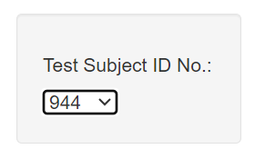
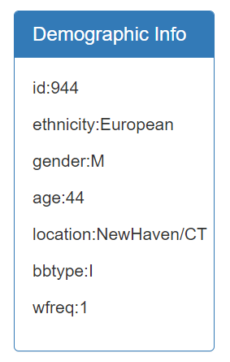
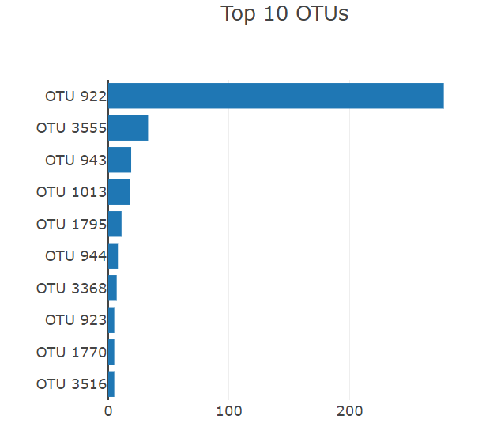
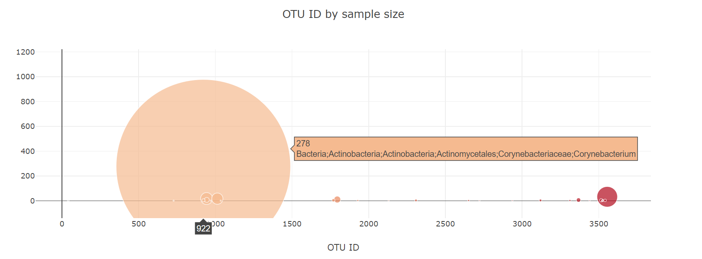

# Belly Button Biodiversity Dashboard

## Description
This project focuses on creating an interactive, user-friendly dashboard to explore the belly button biodiversity dataset. Through dynamic visualizations, users can unlock insights into the intriguing world of navel microbes, fostering seamless navigation for an enhanced understanding of the microbial ecosystem.

## Technologies Used
 - JSON 
 - JavaScript (D3 library)

## File Structure
- 'index.html': HTML file serving as the entry point for the interactive dashboard.
- 'samples.json': JSON file containing data from the belly button biodiversity dataset, providing information about microbial samples obtained from human navels. 

### static
    - 'app.js': JavaScript file that leverages the D3 library to dynamically load and manipulate data from the dataset, facilitating the creation of interactive and visually compelling visualizations on the web page.

## Data Source
Data is retrieved from URL (https://2u-data-curriculum-team.s3.amazonaws.com/dataviz-classroom/v1.1/14-Interactive-Web-Visualizations/02-Homework/samples.json.D3) using D3 library.

## Instructions
Dashboard: https://galklo.github.io/JavaScript_project/

* Values in the dropdown menu are updating based on the nameIDs in the dataset.

* Sample metadata, i.e., an individual's demographic information is displayed in the Demographic Info box. The metadata includes each key-value pair from the metadata JSON object. 

* Two charts are built to display the analysis results:
- Bar chart - shows top 10 OTUs found in that individual. Sample_values is used as the values, otu_ids as the labels and otu_labels as the hovertext.

- Bubble chart - displays each sample. Uses otu_ids for the x values, sample_values for the y values, sample_values for the marker size, otu_ids for the marker color, otu_labels for the text values.

Both charts and the metadata are dynamically changing based on the nameID selected in the dropdown menu

